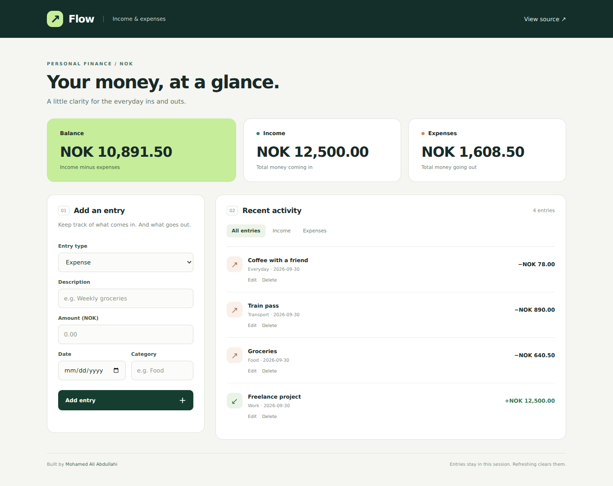

# Flow — Income & Expense Tracker
<sub>REACT · CONTEXT · REDUCERS · RESPONSIVE UI</sub>

A small personal-finance interface with NOK summaries and complete add, edit and delete interactions. No backend is needed to try it.



[Engineering walkthrough](docs/engineering-walkthrough.md) · [Interaction tests](src/App.test.js) · [Mobile screenshot](docs/tracker-mobile.png)

## Try it

```bash
npm ci
npm start
```

Open the address printed by the development server, normally `http://localhost:3000`. Choose **Try sample entries**, or add your own demonstration entry.

The page includes balance, income and expense totals; income/expense filters; deletion confirmation; and an edit form that preserves the date and category. Amounts accept two decimal places. Sample data is loaded only when requested.

## Follow the code

| Concern | Implementation |
| --- | --- |
| Page and totals | [App.js](src/App.js) |
| Shared state and stable IDs | [TransactionProvider.js](src/Providers/TransactionProvider.js) |
| Immutable state transitions | [TranReducer.js](src/reducer/TranReducer.js) |
| Form and validation | [addTrans.js](src/components/addTrans.js) |
| Filtered activity and deletion | [listOfTransaction.js](src/components/listOfTransaction.js) |
| Editing without losing fields | [editTransaction.js](src/components/editTransaction.js) |

## Verify

```bash
npm test -- --watchAll=false --runInBand
npm run build
```

Six interaction tests cover decimals and totals, editing, deletion/cancellation, row behaviour after removing and adding entries, filters, invalid input and explicit sample loading. GitHub Actions runs the tests and build.

## Scope

Entries are held in memory; refreshing clears them. There is no banking integration, authentication or backend. Screenshots use synthetic data in the running app.

This is a UI learning project, not an accounting ledger. The original Create React App toolchain is retained; a build is not a vulnerability audit.
